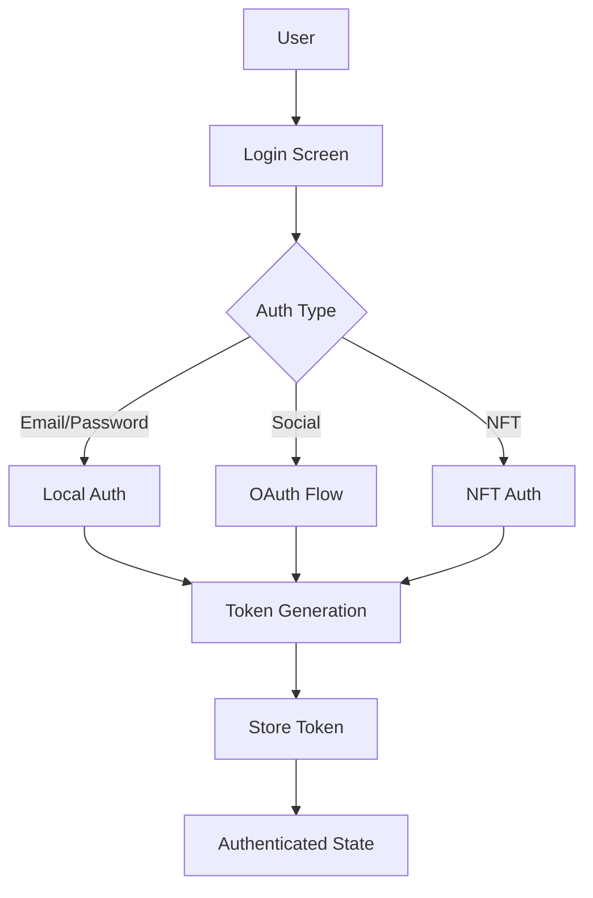
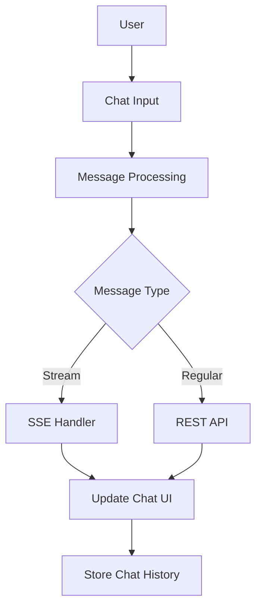
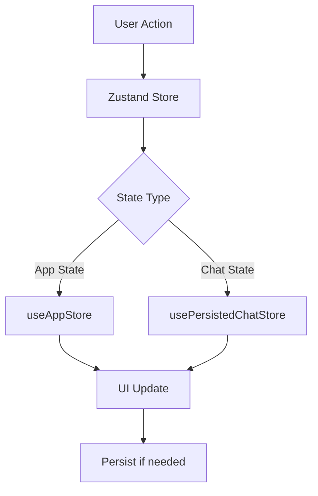
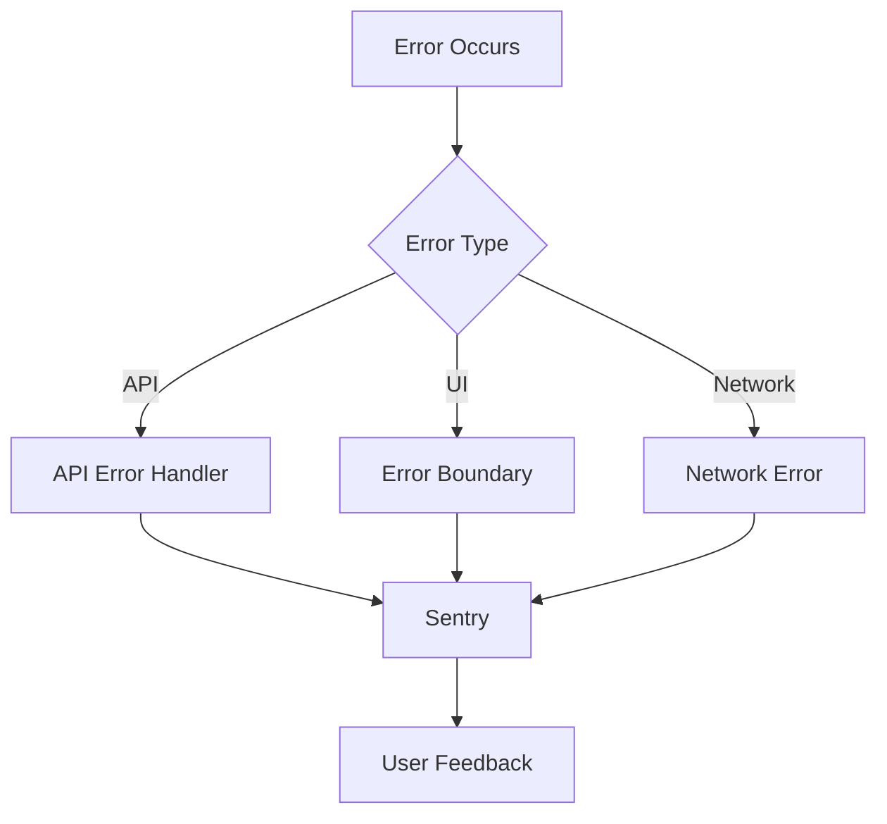
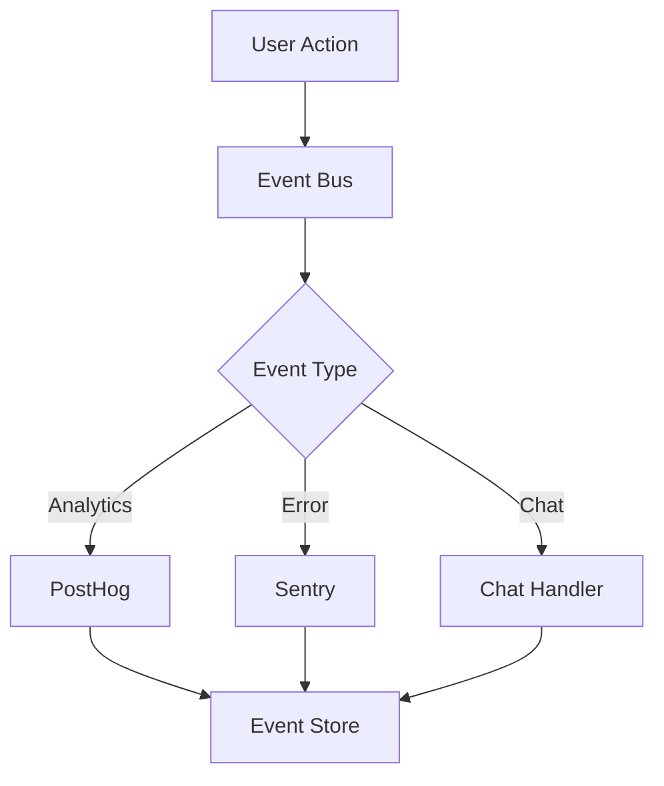

# TokenMetrics Mobile App - Architectural & Data Flow Diagrams

## 1. Core Components

### Frontend Components

- Mobile App (React Native)
  - UI Components
  - Navigation System
  - State Management
  - API Integration
  - Error Handling
  - Analytics

### Backend Services

- Authentication Service
- Chat Service
- User Management Service
- Subscription Service

### External Services

- Supabase
- PostHog Analytics
- Sentry Error Tracking
- OAuth Providers
  - Google
  - Twitter
  - Discord
  - Apple

## 2. Data Flow Patterns

### Authentication Flow



### Chat System Flow



### State Management Flow



## 3. Component Architecture

### UI Layer

```
└── App
    ├── Navigation
    │   ├── RootStack
    │   ├── MainDrawer
    │   └── BottomTabs
    ├── Screens
    │   ├── Auth Screens
    │   ├── Main Screens
    │   └── Modal Screens
    └── Components
        ├── Shared
        ├── Features
        └── Layout
```

### State Layer

```
└── State Management
    ├── Global State (Zustand)
    │   ├── App Store
    │   └── Chat Store
    ├── Local State
    │   ├── Component State
    │   └── Screen State
    └── Persistence
        ├── AsyncStorage
        └── SecureStore
```

## 4. API Integration Architecture

### Service Layer

```
└── Services
    ├── API
    │   ├── Auth
    │   ├── Chat
    │   ├── User
    │   └── Prompts
    ├── WebSocket
    │   └── Chat Stream
    └── External
        ├── Supabase
        ├── PostHog
        └── Sentry
```

## 5. Error Handling Architecture

### Error Flow



## 6. Data Persistence Architecture

### Storage Hierarchy

```
└── Storage
    ├── Secure Storage
    │   ├── Auth Tokens
    │   └── User Credentials
    ├── AsyncStorage
    │   ├── User Preferences
    │   └── Cache
    └── Memory Storage
        ├── App State
        └── UI State
```

## 7. Event Flow Architecture

### Event System



## 8. Security Architecture

### Security Layers

```
└── Security
    ├── Authentication
    │   ├── JWT
    │   ├── OAuth
    │   └── Biometric
    ├── Data Protection
    │   ├── Encryption
    │   └── Secure Storage
    └── API Security
        ├── Token Management
        └── Request Signing
```

## Notes for Diagram Creation

1. Use different colors for:

   - User Interface components (Blue)
   - Business Logic (Green)
   - Data Storage (Yellow)
   - External Services (Purple)
   - Security Components (Red)

2. Connection Types:

   - Solid lines for synchronous operations
   - Dashed lines for asynchronous operations
   - Dotted lines for event-based communication

3. Component Shapes:

   - Rectangles for components
   - Diamonds for decision points
   - Circles for external services
   - Hexagons for security checkpoints

4. Layer Separation:
   - Clear boundaries between layers
   - Distinct zones for different responsibilities
   - Highlighted interaction points

This document serves as a reference for creating comprehensive architectural and data flow diagrams for the TokenMetrics Mobile App.
