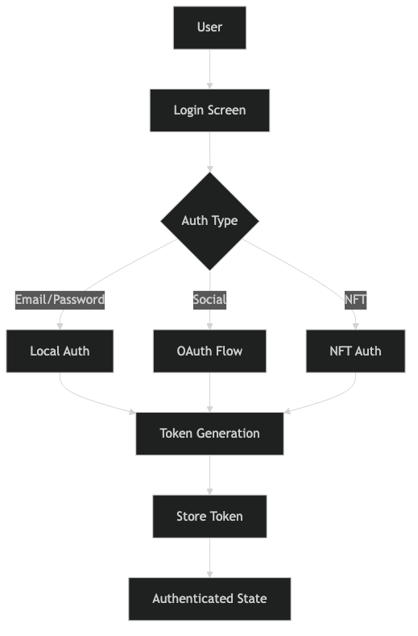
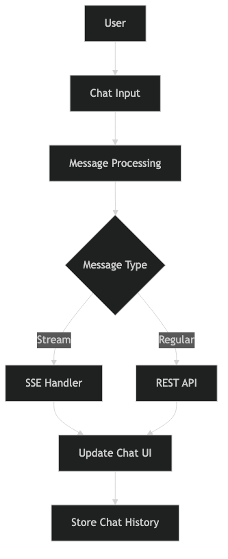
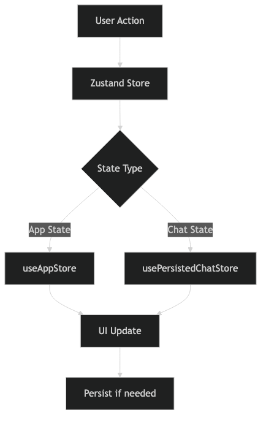
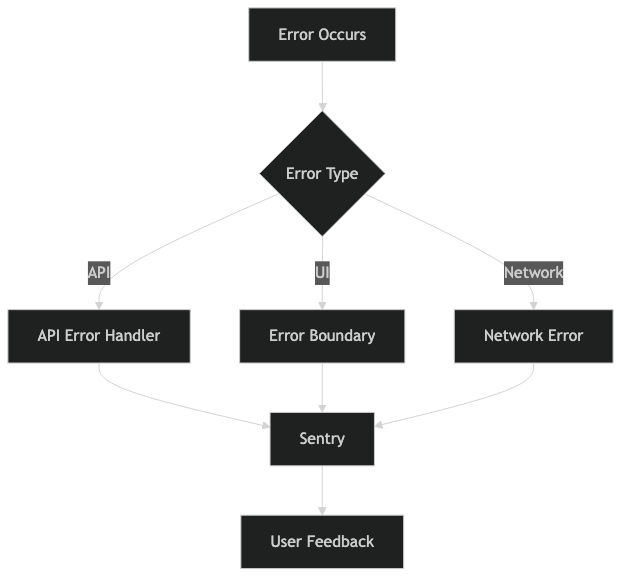
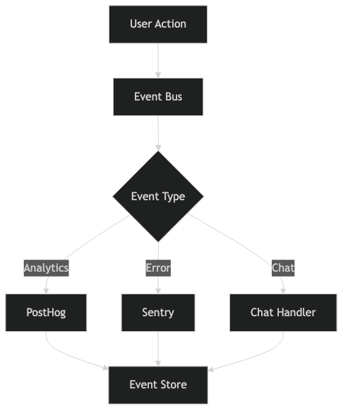

# TokenMetrics Mobile App - Architectural & Data Flow Diagrams

## Core Components

### Frontend Components

- Mobile App (React Native)
  - UI Components
  - Navigation System
  - State Management
  - API Integration
  - Error Handling
  - Analytics

### Backend Services

- Authentication Service
- Chat Service
- User Management Service
- Subscription Service

### External Services

- Supabase
- PostHog Analytics
- Sentry Error Tracking
- OAuth Providers
  - Google
  - Twitter
  - Discord
  - Apple

## Data Flow Patterns

### Authentication Flow



The authentication flow diagram shows the process of user authentication, including:

- Multiple authentication methods (Email/Password, Social, NFT)
- Token generation and storage
- State management for authenticated users

### Chat System Flow



The chat system flow illustrates:

- User input processing
- Message type handling (Stream vs Regular)
- UI updates and history storage
- Integration with SSE and REST APIs

### State Management Flow



The state management diagram demonstrates:

- Zustand store implementation
- Different state types (App State vs Chat State)
- UI updates and persistence logic
- State synchronization flow

## Error Handling Architecture

### Error Flow



The error handling architecture shows:

- Different types of errors (API, UI, Network)
- Error handling mechanisms
- Integration with Sentry
- User feedback flow

## Event Flow Architecture

### Event System



The event system diagram illustrates:

- Event bus implementation
- Different event types (Analytics, Error, Chat)
- Integration with external services
- Event storage and handling

## Component Architecture

### UI Layer

```
└── App
    ├── Navigation
    │   ├── RootStack
    │   ├── MainDrawer
    │   └── BottomTabs
    ├── Screens
    │   ├── Auth Screens
    │   ├── Main Screens
    │   └── Modal Screens
    └── Components
        ├── Shared
        ├── Features
        └── Layout
```

### State Layer

```
└── State Management
    ├── Global State (Zustand)
    │   ├── App Store
    │   └── Chat Store
    ├── Local State
    │   ├── Component State
    │   └── Screen State
    └── Persistence
        ├── AsyncStorage
        └── SecureStore
```

## API Integration Architecture

### Service Layer

```
└── Services
    ├── API
    │   ├── Auth
    │   ├── Chat
    │   ├── User
    │   └── Prompts
    ├── WebSocket
    │   └── Chat Stream
    └── External
        ├── Supabase
        ├── PostHog
        └── Sentry
```

## Data Persistence Architecture

### Storage Hierarchy

```
└── Storage
    ├── Secure Storage
    │   ├── Auth Tokens
    │   └── User Credentials
    ├── AsyncStorage
    │   ├── User Preferences
    │   └── Cache
    └── Memory Storage
        ├── App State
        └── UI State
```

## Security Architecture

### Security Layers

```
└── Security
    ├── Authentication
    │   ├── JWT
    │   ├── OAuth
    │   └── Biometric
    ├── Data Protection
    │   ├── Encryption
    │   └── Secure Storage
    └── API Security
        ├── Token Management
        └── Request Signing
```

## Notes for Diagram Styling

1. Color Scheme:

   - User Interface components: Blue (#4A7DFF)
   - Business Logic: Green (#4CAF50)
   - Data Storage: Yellow (#FFC107)
   - External Services: Purple (#7C5CFF)
   - Security Components: Red (#FF5C5C)

2. Connection Types:

   - Solid lines: Synchronous operations
   - Dashed lines: Asynchronous operations
   - Dotted lines: Event-based communication

3. Component Shapes:

   - Rectangles: Components
   - Diamonds: Decision points
   - Circles: External services
   - Hexagons: Security checkpoints

4. Layer Separation:
   - Clear boundaries between layers
   - Distinct zones for different responsibilities
   - Highlighted interaction points

This document serves as a comprehensive reference for the architectural and data flow diagrams of the TokenMetrics Mobile App, with visual representations of key system components and their interactions.
